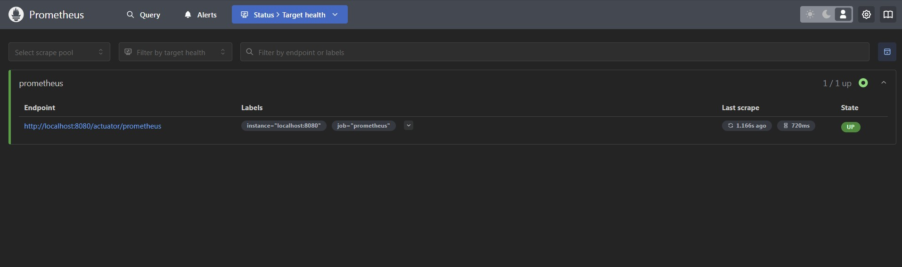
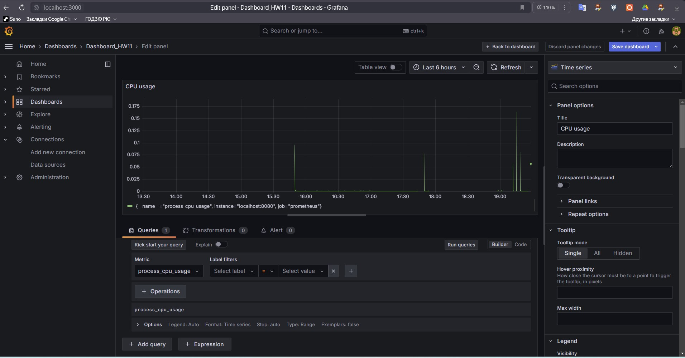
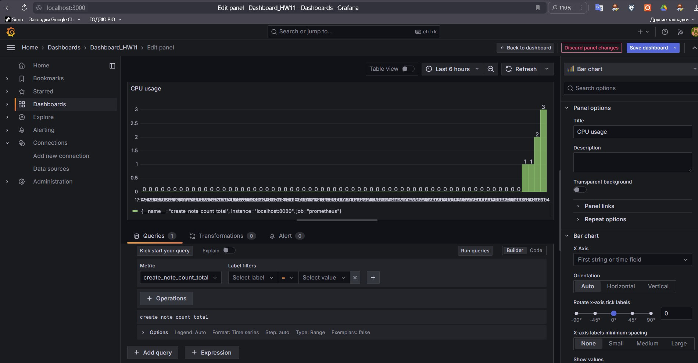
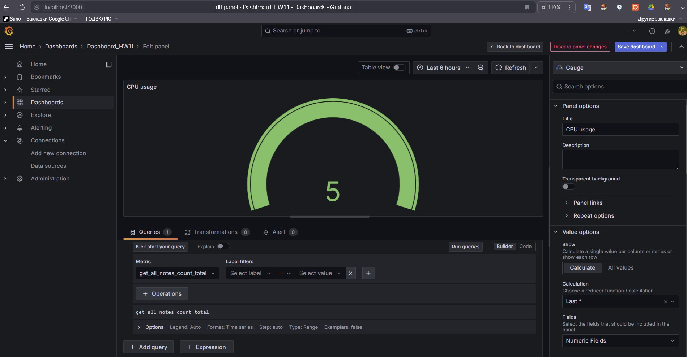

# Фреймворк Spring
## Spring Actuator. Настройка мониторинга с Prometheus и Grafana.
### Задание: Используйте Spring Actuator для отслеживания метрик вашего приложения.

### Настройте визуализацию этих метрик с использованием Prometheus и Grafana.
 

### Использование Prometheus

 

### Использование Grafana

 

 

